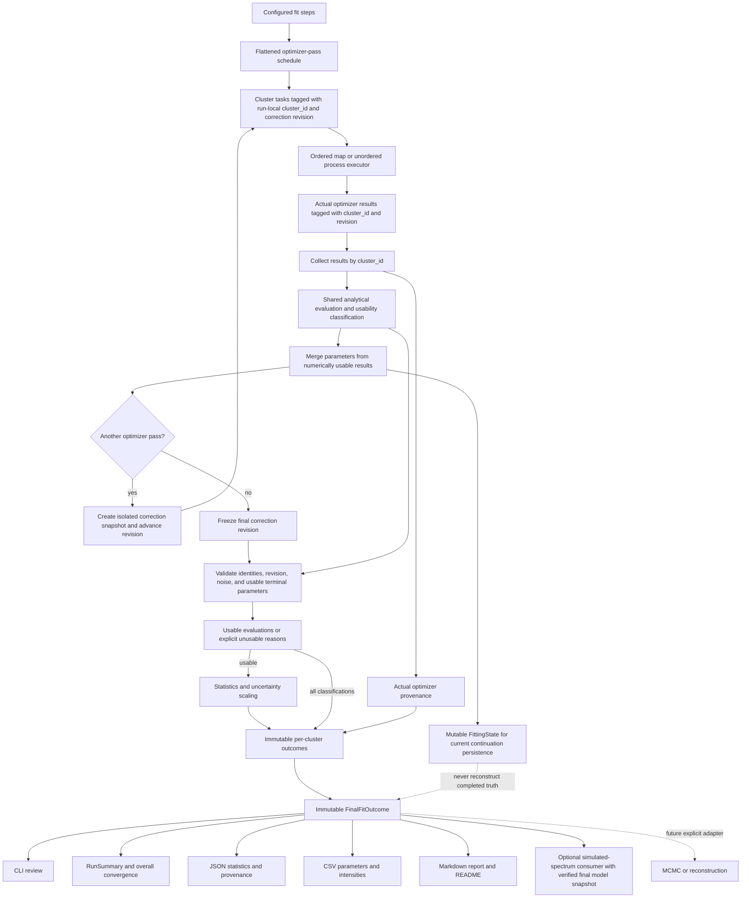

# Authoritative Final Fit Outcome

**Status:** completed

**Lifecycle:** historical implementation record

**Completion:** The approved `FinalFitOutcome` design was implemented and
validated on 2026-07-26. This document preserves the rationale, migration plan,
and ticket chronology; current architecture and operational behavior are
authoritative in code and current documentation.

## Evidence Classification

- **Verified** — supported directly by source, tests, configuration, deterministic Graphify structure, or observed repository history.
- **Likely** — strongly suggested by verified behavior but not yet established by an executable characterization.
- **Unknown** — requires maintainer scientific or historical knowledge.
- **Decision** — the contract chosen for this specification.

Graphify was used only for scoped structural orientation. Semantic and inferred
edges were not treated as proof. Material conclusions below were checked in the
current source and tests.

## Problem Statement

PeakFit currently has two competing descriptions of a completed fit run.

The fitting pipeline retains the real final optimizer result for each peak
cluster. CLI review and `RunSummary` use those results, including their actual
success state and reduced chi-squared. Output construction later ignores those
optimizer results, re-evaluates mutable `FittingState`, independently solves
amplitudes and residuals, and synthesizes convergence metadata.

Consequently:

- a cluster can be reported as failed in the CLI and converged in JSON or
  Markdown;
- persisted evaluation counts and messages can be invented rather than copied
  from the optimizer;
- optimizer type and optimizer-specific termination information are lost;
- cluster association relies partly on list positions and open metadata;
- persisted amplitudes, residuals, statistics, and uncertainty scaling are not
  represented as one completed scientific evaluation;
- the pipeline mutates cross-talk corrections after the final optimizer pass,
  so retained optimizer results and persisted working state describe different
  fitting problems.

This is a correctness and authority problem, not primarily a serialization
problem.

## Current Behavior and Evidence

### Verified pipeline behavior

1. Pipeline tasks are assigned positional task indices. Unordered results are
   restored to input-list order through those indices.
2. `FitResult` also carries a run-local cluster identifier inside an open
   metadata dictionary.
3. After each pass, the pipeline merges returned parameters and unconditionally
   updates cross-talk corrections.
4. The same update occurs after the terminal pass, but no optimizer pass follows
   it.
5. The returned `PipelineResult` therefore combines:
   - optimizer results produced under correction revision `r`; and
   - mutable cluster state at correction revision `r + 1`.
6. Normal cluster creation supplies unique run-local identifiers, but the
   pipeline does not validate uniqueness and manually created clusters can
   bypass that producer.

### Verified numerical behavior

1. VARPRO analytically solves amplitudes through QR decomposition while
   evaluating its objective.
2. Basin hopping uses the VARPRO objective internally and performs a terminal
   amplitude restoration and residual evaluation.
3. Ordinary residual evaluation solves analytical amplitudes again.
4. Output construction solves amplitudes with uncertainty, then separately
   invokes residual evaluation, which performs another amplitude solve.
5. These paths share lower-level QR primitives but do not share one complete
   amplitude/model/residual evaluation operation.
6. Persisted amplitude standard errors are scaled by
   `sqrt(reduced_chi_squared)` only when reduced chi-squared exceeds one.
7. Observation, amplitude-parameter, degree-of-freedom, and reduced-chi-squared
   counts use the resolved `(n_points, n_series)` cluster contract.

### Verified consumer behavior

1. CLI review and `RunSummary` consume real optimizer results.
2. `build_fit_results` accepts only `FittingState` and reconstructs writer-facing
   results.
3. Output statistics currently synthesize convergence as true, evaluation count
   as zero, and a persistence-generated message.
4. The JSON schema can represent evaluation count and message, but the JSON
   writer currently omits them and schema defaults hide the omission.
5. JSON statistics are stored separately from cluster estimates and are
   associated by list position.
6. `FitResults.method` defaults to `least_squares`; the actual optimizer is not
   reliably persisted.
7. Markdown associates clusters and statistics by list position.
8. CSV writers consume writer-facing estimates without recalculating them.
9. The optional simulated-spectrum writer currently receives mutable clusters
   and parameters rather than a completed immutable outcome.
10. `FittingState` is persisted separately for current MCMC and reconstruction
    workflows.

### Existing executable protection

- Unequal point/series tests protect cluster counts, amplitudes, residual shape,
  statistics, uncertainty scaling, simulation orientation, and schema/state
  invalidation.
- Output tests protect file planning, current JSON schema version, CSV layout,
  Markdown summaries, and README generation.
- The representative real-data workflow protects broad output structure and a
  compatibility chi-squared range.
- There is no current test for mixed optimizer success, stable identity under
  unordered execution, correction ordering, actual optimizer provenance in
  persisted output, or agreement among final consumers.
- The real-data golden values are compatibility baselines with broad tolerances,
  not documented independently validated scientific references.

### Evidence map

| Concern | Directly verified source or test |
| --- | --- |
| Positional task collection and terminal correction update | `run_pipeline_iter`, `_prepare_cluster_tasks`, and `_process_execution_results` in `src/peakfit/fit/pipeline.py` |
| Mutable working state | `FittingState` in `src/peakfit/engine/domain/state.py` |
| Optimizer result fields | `FitResult` in `src/peakfit/engine/results.py` |
| VARPRO analytical solve and terminal result | `VarProOptimizer` and `fit_cluster` in `src/peakfit/engine/algorithms/varpro.py` |
| Basin-hopping restoration and message-based success promotion | `fit_basin_hopping` and `_restore_amplitude_params` in `src/peakfit/engine/algorithms/basin_hopping.py` |
| Shared lower-level residual and correction operations | `residuals` and `update_cluster_corrections` in `src/peakfit/engine/algorithms/common.py` |
| Analytical amplitude uncertainty solve | `calculate_amplitudes_with_uncertainty` in `src/peakfit/engine/algorithms/linear_algebra.py` |
| Independent output reconstruction and synthetic provenance | `build_fit_results`, `_build_cluster_output`, and `_build_cluster_statistics` in `src/peakfit/fit/results.py` |
| CLI review and summary truth | `find_review_clusters` and `_build_summary` in `src/peakfit/fit/fitting.py` |
| Fit-run and summary containers | `FitRun` and `RunSummary` in `src/peakfit/fit/run_models.py` |
| Writer orchestration and formats | `src/peakfit/io/writers/orchestrator.py`, `json.py`, and `markdown.py` |
| Current JSON shape and defaults | `FitSummarySchema` and statistics schemas in `src/peakfit/io/schemas.py` |
| Reconstructed mutable state on read | `ResultsLoader` in `src/peakfit/io/readers/results.py` |
| Count and uncertainty regression protection | `tests/test_point_series_axis_contract.py` |
| Output projection protection | `tests/test_fit_summary_schema.py`, `tests/test_markdown_report.py`, `tests/test_run_readme.py`, and `tests/test_output_plan.py` |
| Representative compatibility baseline | `tests/integration/test_golden_regression.py` and `tests/data/golden/baseline.json` |

Scoped Graphify operations used for orientation were:

- `graphify query` for the final optimizer-result flow, output reconstruction,
  and terminal correction scheduling;
- `graphify path update_cluster_corrections fit_with_optimizer`;
- `graphify path PipelineResult write_fit_outputs`;
- `graphify path FitResult build_fit_results`;
- `graphify explain PipelineResult`;
- `graphify explain FitResult`.

Graphify supplied deterministic AST/import relationships and semantic
suggestions. The table above, source inspection, and tests—not semantic edges—
support the verified conclusions.

## Solution

Introduce one deep finalization module with one construction interface that
turns pipeline completion data into an immutable `FinalFitOutcome`.

Its conceptual interface is:

```text
finalize_fit(pipeline_completion) -> FinalFitOutcome
```

`pipeline_completion` is internal orchestration data. It contains the final
working/continuation state, positive finite noise, the expected run-local
cluster identities, and final optimizer-result envelopes keyed by cluster
identity. It also carries the immutable or isolated copy of the frozen final
correction snapshot and its monotonically increasing `correction_revision`.
Each result envelope carries the optimizer result, correction revision, and
noise used for that invocation.

`FinalFitOutcome` contains:

- an immutable ordered collection of `FinalClusterOutcome` values;
- immutable global statistics;
- derived overall convergence state and `RunSummary`;
- deterministic lookup by run-local `cluster_id`.

Each `FinalClusterOutcome` contains:

- `cluster_id` and peak names;
- the three-state outcome classification: converged, usable non-converged, or
  unusable;
- immutable final nonlinear estimates and analytical model evaluation when the
  outcome is numerically usable;
- one internally consistent statistics record when numerically usable;
- an explicit usability failure reason when unusable;
- actual terminal optimizer provenance;
- final correction revision.

`PipelineResult` remains an orchestration return value containing exactly:

- the authoritative `FinalFitOutcome`; and
- separately named mutable continuation state for current stateful workflows.

`PipelineResult` itself is not the scientific authority, and continuation state
is not reachable through the outcome.

The module hides:

- validation of run-local peak-cluster identity;
- validation of correction revision and final optimizer attempts;
- the shared numerical-usability classification;
- the shared final analytical amplitude evaluation;
- construction of model values and residuals;
- calculation of per-cluster and global statistics;
- amplitude uncertainty scaling;
- normalization of actual optimizer provenance;
- construction of immutable parameter and amplitude estimates;
- derivation of overall convergence state, summary, and review information.

The module does not own:

- optimizer algorithms;
- lineshape mathematics;
- output paths, timestamps, checksums, or Git metadata;
- JSON, CSV, Markdown, pickle, or NMRPipe formats;
- MCMC or reconstruction behavior.

`FittingState` remains a mutable working/continuation state. It is not a
completed fit result and must never be consulted to reconstruct convergence or
fit statistics after `FinalFitOutcome` exists.

## Authoritative Final State

### Fit-pass and correction definition

**Decision.** Flatten configured fit steps into a finite ordered sequence of
optimizer passes.

For a sequence of `N` optimizer passes:

1. Pass 1 uses the initial correction revision.
2. Every optimizer result is classified as converged, usable non-converged, or
   unusable through the shared analytical evaluation.
3. Nonlinear parameters are merged only from converged or usable
   non-converged results.
4. If another pass remains, cross-talk corrections are updated from those
   numerically usable parameters and `correction_revision` advances by one.
5. The next pass is optimized against an immutable correction snapshot, or an
   isolated copy, carrying that revision.
6. After pass `N`, usable parameters are merged and no further correction
   update occurs.
7. The correction snapshot used by pass `N` is the frozen final correction
   state for the fit run.

`refine_iterations` is the number of optimizer passes, not the number of
additional passes. It must be at least one. With no explicit fit steps,
`refine_iterations = N` produces exactly `N` optimizer passes and exactly
`N - 1` correction updates. Explicit step iteration counts already denote
optimizer passes; their flattened total supplies `N`.

Correction identity consists only of the frozen snapshot and its monotonically
increasing revision. A digest is not part of the design. Immutability or copying
prevents later mutation from changing the snapshot observed by an optimizer
invocation. Terminal results must reference the frozen final revision.

This definition guarantees that every final peak-cluster model has actually
been optimized while holding its final correction state fixed. It does not
require or claim fixed-point convergence.

### Numerical usability classification

Convergence and numerical usability are separate facts.

- **Converged** — the terminal optimizer reports convergence and the shared
  analytical evaluation is numerically usable.
- **Usable non-converged** — the optimizer does not report convergence, but its
  cluster-relevant nonlinear parameters are finite and the shared analytical
  evaluation produces finite amplitudes, model values, residuals, cost or
  chi-squared under the referenced correction revision and noise.
- **Unusable** — required parameters are non-finite, shared analytical
  evaluation fails, or any required final model, residual, cost, chi-squared, or
  amplitude is non-finite. An optimizer convergence Boolean cannot override
  numerical unusability.

The classifier returns both convergence status and usability status, from which
the three-state outcome classification is derived. It also returns an explicit
reason when unusable. The same classification operation gates intermediate
parameter merging and correction updates and supplies final outcome assembly;
the pipeline and finalizer must not implement competing usability rules.

### Per-cluster authoritative state

A final peak-cluster outcome is authoritatively associated only when:

1. its `cluster_id` is unique within the fit run;
2. exactly one final optimizer result exists for that identifier;
3. no missing or unexpected identifier exists;
4. the final optimizer result was produced under the final correction revision;
5. the positive finite noise value is the same value used by the terminal
   optimizer invocation;
6. its convergence and usability statuses are explicitly classified;
7. for a usable outcome, every cluster-relevant nonlinear value in the final
   merged parameter snapshot equals the value in the terminal optimizer result;
8. for a usable outcome, amplitudes are analytically solved from:
   - those nonlinear parameters;
   - the final corrected cluster data;
   - the final design matrix;
9. amplitude solving uses the same shared numerical operation as fitting;
10. for a usable outcome, model values, raw residuals, normalized residuals,
    chi-squared, information criteria, amplitude uncertainty, and uncertainty
    scaling derive from that same evaluation;
11. for a usable outcome, terminal optimizer residual and cost agree with the
    shared terminal
    evaluation within existing optimizer-specific numerical tolerances, or a
    characterized optimizer-specific representation difference is recorded and
    tested;
12. optimizer provenance is copied from the actual terminal optimizer result;
13. an unusable outcome contains its identity, classification, failure reason,
    correction revision, and trustworthy provenance, but no invented model or
    statistics;
14. no mutable `Cluster`, `Parameters`, list, dictionary, or writable array is
    retained by reference.

The analytical re-solve is authoritative even if mutable amplitude parameters
in working state differ. That difference must first be characterized; it must
not be hidden by a tolerance change or a new solver.

### Mixed outcome handling

**Decision.**

- Converged and usable non-converged results may update parameters and influence
  later corrections.
- Unusable results must not update parameters or influence later corrections.
- A returned unusable terminal optimizer result remains in the immutable
  outcome with its identity, classification, failure reason, and trustworthy
  provenance.
- Overall convergence is true only when every final cluster outcome is
  classified as converged.
- CLI review and durable output expose all three classifications.
- An optimizer exception, missing result, duplicate identifier, unexpected
  identifier, or stale correction revision prevents construction of a completed
  `FinalFitOutcome`.
- Missing, nonpositive, non-finite, or optimizer/result-mismatched noise prevents
  construction of a completed `FinalFitOutcome`.
- An empty peak-cluster set is not a completed fit and fails explicitly before
  finalization.
- This specification does not introduce partial-run persistence after worker
  exceptions.

### Counts and statistics

For each numerically usable final peak-cluster outcome:

- number of observations = `cluster.n_observations`;
- number of amplitude parameters = number of peaks × number of series;
- number of varied nonlinear parameters = varied non-amplitude parameters
  belonging to the cluster at the terminal pass;
- number of fitted parameters = varied nonlinear parameters + amplitude
  parameters;
- degrees of freedom = the existing capped
  `max(1, n_observations - n_fitted_parameters)` behavior;
- chi-squared = sum of squared normalized residuals;
- reduced chi-squared = chi-squared / degrees of freedom;
- amplitude standard error = analytical base error multiplied by
  `sqrt(reduced_chi_squared)` only when reduced chi-squared exceeds one;
- AIC, BIC, and log likelihood preserve their current formulas and exclusions.

Global fit-quality statistics aggregate converged and usable non-converged
outcomes and exclude unusable outcomes. Overall convergence is true only if
every peak cluster converged. Function-evaluation count aggregates trustworthy
terminal counts that are available; absence is represented as unavailable
rather than zero. A total across all refinement passes would be a distinct
future metric.

`RunSummary` explicitly reports:

- total cluster count;
- converged count;
- usable non-converged count;
- unusable count;
- each fit-quality distribution and that distribution's population size.

Reduced-chi-squared distributions include converged and usable non-converged
outcomes and exclude unusable outcomes. Each future distribution independently
declares its population size instead of relying on a single implicit global
denominator.

### Optimizer provenance

Every final peak-cluster outcome records immutable provenance from its actual
terminal optimizer invocation:

- optimizer kind;
- convergence status;
- usability status;
- termination message or termination code;
- function-evaluation count;
- iteration count where available;
- final cost or chi-squared;
- correction revision;
- optimizer-specific metadata only when it is useful and trustworthy.

Unavailable information remains absent. It is never replaced with zero,
success, or a persistence-generated message.

The provenance count describes the terminal optimizer invocation. A future
total-work metric across all passes must have a distinct name and contract.

There is no artificial common provenance superset. Optimizer-specific
termination status, optimality, Jacobian evaluations, basin-hopping details, or
seed are persisted only where they are useful and actually available. Elapsed
wall time and initial cost remain diagnostic metadata unless later evidence
justifies making them durable.

For basin hopping, the actual terminal local optimizer convergence signal is
preserved as convergence status. The current message-based promotion of failure
to convergence is not preserved. Independent usability classification
determines whether its finite result can influence corrections or supply
scientific statistics.

### Immutability

`FinalFitOutcome` is deeply immutable at its public interface:

- collections are immutable;
- mutable scalar-parameter objects are converted into immutable value records;
- arrays are copied and made non-writeable, or converted into immutable value
  records;
- mutation of `FittingState`, `Cluster`, or `Parameters` after finalization
  cannot change any outcome value.

The optional simulated-spectrum workflow may use a separately retained final
model snapshot because full-grid evaluation requires spectral grids and
lineshape implementations that are not writer-facing fit estimates. That
adapter must verify run identity, cluster identities, final parameter values,
noise, and correction revision against the outcome. It must use authoritative
outcome amplitudes and must not solve amplitudes again. Unusable cluster
outcomes cannot be simulated as if a final scientific model existed.

## Data Flow



## User Stories

1. As a PeakFit user, I want the CLI and output files to agree whether each peak
   cluster converged, remained numerically usable without convergence, or became
   unusable, so that I do not receive contradictory fit guidance.
2. As a PeakFit user, I want reported evaluation counts and messages to come from
   the optimizer, so that diagnostics describe the computation that actually
   ran.
3. As a PeakFit user, I want final statistics to describe a model optimized
   under its final cross-talk correction, so that persisted quality measures do
   not describe a hybrid state.
4. As a PeakFit user, I want amplitudes, residuals, chi-squared, and uncertainty
   scaling to come from one final evaluation, so that reported quantities are
   internally consistent.
5. As a PeakFit user, I want non-converged and unusable peak clusters retained
   with explicit classifications and provenance, so that successful clusters do
   not hide problematic ones.
6. As a PeakFit user, I want output schema breaks to be explicit, so that
   development artifacts with synthetic truth are not silently accepted.
7. As a maintainer, I want one immutable completed fit result, so that later
   mutation of working state cannot rewrite historical fit truth.
8. As a maintainer, I want run-local cluster identifiers to establish
   association, so that multiprocessing completion order cannot misattach
   results.
9. As a maintainer, I want duplicate, missing, stale, and unexpected cluster
   results to fail explicitly, so that pipeline corruption is immediately
   visible.
10. As a numerical developer, I want fitting and finalization to share one
    analytical amplitude operation, so that rank-deficiency handling and
    residual construction cannot drift.
11. As a numerical developer, I want existing optimizer mathematics and
    tolerances characterized before consolidation, so that refactoring does not
    silently change fitted values.
12. As a CLI developer, I want summary and review views derived from the final
    outcome, so that presentation code does not interpret raw optimizer state.
13. As an output developer, I want every writer to project `FinalFitOutcome`
    directly, so that persistence cannot invent scientific or optimizer facts.
14. As an output developer, I want statistics explicitly associated with
    `cluster_id`, so that JSON and Markdown do not depend on parallel list
    positions.
15. As a future MCMC developer, I want completed fit truth separated from
    mutable continuation state, so that post-fit sampling can extend results
    without redefining the original fit.
16. As a future reconstruction developer, I want an explicit later adapter
    rather than a claim that report-shaped data are complete numerical state.
17. As an AI-assisted contributor, I want a small finalization interface with
    executable invariants, so that future changes have one obvious seam and
    cannot easily recreate competing truth.
18. As a PeakFit user, I want every summary distribution to state its population
    size, so that excluded unusable clusters are visible.
19. As a numerical developer, I want correction updates to use only explicitly
    usable results, so that a misleading convergence Boolean or non-finite
    result cannot contaminate the next fitting problem.

## Design Comparison

### Design 1 — Deep immutable `FinalFitOutcome`

The pipeline produces internal completion data. One finalization interface
validates it and returns a separate immutable `FinalFitOutcome`.

| Concern | Evaluation |
| --- | --- |
| Authority and ownership | One completed scientific result; working state remains explicitly separate. |
| Mutation boundary | Finalization copies values across the mutable-to-immutable seam exactly once. |
| Mixed success | Naturally represented per peak cluster without treating failure as an exception. |
| Terminal correction | Finalizer accepts only optimizer results stamped with the frozen final revision. |
| Cluster identity | First-class run-local identifier with exact-set validation. |
| Numerical duplication | One shared analytical evaluation behind the finalization module. |
| Persistence coupling | None in the finalization interface; writers are adapters/projections. |
| Testability | Highest: the interface is the direct in-memory test surface. |
| Migration size | Medium: new outcome types, finalizer, `FitRun`, and consumer migration. |
| Rollback | Add alongside current reconstruction, compare, migrate, then delete. |
| Future MCMC/reconstruction | Clean extension point without claiming completed output is continuation state. |
| Depth and locality | Highest leverage and clearest locality of scientific completion rules. |

### Design 2 — Enrich `PipelineResult` as the authority

`PipelineResult` would directly contain immutable per-cluster outcomes,
statistics, provenance, and derived summaries.

| Concern | Evaluation |
| --- | --- |
| Authority and ownership | Can be singular, but durable truth remains named and located as orchestration output. |
| Mutation boundary | Correct only if mutable `FittingState` is removed or separated. |
| Mixed success | Representable. |
| Terminal correction | Good locality inside pipeline execution. |
| Cluster identity | Can use the same exact-set validation. |
| Numerical duplication | Can use the shared analytical operation. |
| Persistence coupling | Risk that pipeline grows output concerns as more consumers depend on it. |
| Testability | Good, but finalization tests must exercise or construct orchestration-oriented data. |
| Migration size | Medium and nominally smaller than Design 1. |
| Rollback | Straightforward before consumer cutover. |
| Future MCMC/reconstruction | Couples durable scientific truth to pipeline terminology and module ownership. |
| Depth and locality | Viable, but execution mechanics and completed scientific truth remain conflated. |

### Design 3 — Keep reconstruction with stricter rules

`build_fit_results` would accept pipeline state and results, validate identities,
use the shared analytical operation, preserve provenance, and become the result
authority.

| Concern | Evaluation |
| --- | --- |
| Authority and ownership | Better than current behavior but located inside output construction. |
| Mutation boundary | A mutation window remains between pipeline completion and reconstruction. |
| Mixed success | Requires explicit joining and propagation rules. |
| Terminal correction | Can reject stale results but does not naturally own pass scheduling. |
| Cluster identity | Can validate identifiers, though joins remain output concerns. |
| Numerical duplication | Can be removed. |
| Persistence coupling | Highest; scientific completion remains mixed with metadata, checksums, and schemas. |
| Testability | Good for writer-ready output, weaker as a scientific in-memory seam. |
| Migration size | Smallest. |
| Rollback | Easiest. |
| Future MCMC/reconstruction | Output-shaped result is an unsuitable numerical continuation interface. |
| Depth and locality | A defensible narrow fix, but retains three competing result concepts and a shallow seam. |

### Recommendation

**Decision: choose Design 1, a separate immutable `FinalFitOutcome`.**

It is the only design that makes the mutable-working-state/completed-result
distinction unmistakable while keeping numerical completion independent of
pipeline mechanics and persistence formats. Deleting this module would force
identity validation, correction-revision validation, analytical evaluation,
statistics, uncertainty scaling, provenance, aggregation, and immutability back
into several callers; therefore the module earns substantial depth.

No new remote, filesystem, or dependency-injection seam is required. All
finalization dependencies are in-process computation. The existing executor
seam remains internal and justified by synchronous, multiprocessing, and
deterministic-test adapters.

## Implementation Decisions

1. `FinalFitOutcome` is the only authoritative completed fit-run result.
2. It contains immutable per-cluster outcomes with first-class run-local
   `cluster_id`.
3. Normal display ordering may sort by identifier, but order never establishes
   association.
4. Pipeline entry rejects duplicate cluster identifiers.
5. Pipeline completion rejects missing or unexpected final identifiers.
6. `refine_iterations` is the number of optimizer passes and must be at least
   one.
7. A flattened schedule of `N` passes performs exactly `N - 1` correction
   updates.
8. Optimizer tasks and results carry an explicit, monotonically increasing
   correction revision.
9. Each pass receives an immutable correction snapshot or isolated copy.
10. Correction revisions advance only between scheduled optimizer passes; no
    correction update occurs after the terminal pass.
11. Correction digests are not introduced without a demonstrated failure mode.
12. Finalization rejects optimizer results from a stale revision.
13. One shared analytical operation evaluates both numerical usability and the
    final amplitude/model/residual state while preserving existing QR and
    rank-deficiency mathematics.
14. Every returned optimizer result is classified as converged, usable
    non-converged, or unusable.
15. Only converged and usable non-converged results may update parameters or
    influence later corrections.
16. The same usability classification feeds correction scheduling and immutable
    finalization; there is no second classification rule.
17. Finalization performs one internally consistent amplitude/model/residual
    evaluation for each numerically usable peak cluster.
18. Unusable outcomes retain identity, failure reason, correction revision, and
    trustworthy provenance without invented model values or statistics.
19. Optimizer-injected amplitude parameters are not an independent authority.
20. Per-cluster statistics and optimizer provenance are stored together with
    cluster identity.
21. Overall convergence, `RunSummary`, and review classifications are derived
    from the immutable outcome.
22. `RunSummary` reports total, converged, usable non-converged, and unusable
    counts, and a population size for every fit-quality distribution.
23. Fit-quality distributions include converged and usable non-converged
    outcomes and exclude unusable outcomes.
24. `FitRun` carries the outcome plus operational context and a separately named
    mutable continuation state while current state persistence requires it.
25. Redundant stored copies of optimizer results, overall convergence, and
    summary are removed after all consumers migrate.
26. The legacy `build_fit_results` reconstruction is removed. Writers receive
    `FinalFitOutcome` directly plus only operational metadata and plane values;
    they perform no fitting, amplitude solve, residual calculation, statistic
    calculation, identity inference, convergence inference, or usability
    inference.
27. JSON persists trustworthy optimizer provenance, outcome classification, and
    explicit cluster association.
28. JSON schema receives a clean major development-version bump from `3.0.0` to
    `4.0.0`; old output is rejected with an error naming both encountered
    `3.0.0` and supported `4.0.0` versions.
29. In JSON 4.0.0, each cluster object contains its own classification,
    statistics when usable, and optimizer provenance. There is no parallel
    top-level per-cluster statistics list.
30. Durable common provenance contains optimizer kind, convergence status,
    usability status, termination message or code, function-evaluation count,
    iteration count when available, final cost or chi-squared, and correction
    revision.
31. Optimizer-specific metadata is retained only where useful and trustworthy;
    artificial common fields are not invented.
32. CSV and Markdown writers receive writer-facing projections of the same
    outcome; they do not independently join scientific values by position.
33. The optional simulated-spectrum path uses outcome amplitudes plus a verified
    matching final model snapshot and does not choose new analytical amplitudes.
    Unusable outcomes do not produce invented simulated models.
34. Current mutable continuation-state persistence remains available for MCMC
    and reconstruction, but is explicitly not completed fit truth.
35. No fixed-point cross-talk convergence is introduced.
36. No ADR is created until implementation produces a durable decision worth
    recording and the maintainer separately approves it.

## Characterization and Testing Decisions

### Test-surface decision

The highest new seam is finalization from pipeline completion data to
`FinalFitOutcome`. Tests should assert observable outcome invariants through
that interface rather than private helper layout.

Existing seams remain useful for:

- optimizer-specific numerical characterization;
- pipeline scheduling and executor ordering;
- CLI workflow agreement;
- writer projection/schema validation;
- the representative real-data CLI workflow.

Temporary characterization tests may explicitly demonstrate the current
contradiction. They must be named as current behavior and must not become a
permanent compatibility requirement. Desired-contract tests may initially be
strict expected failures, then become ordinary passing tests in the ticket that
implements the behavior. The main branch must remain green at every ticket
boundary.

### Required characterization matrix

| Behavior | Current truth to expose | Desired contract |
| --- | --- | --- |
| Mixed outcomes | CLI uses optimizer success while output synthesizes convergence. | Every consumer reports converged, usable non-converged, or unusable consistently. |
| Numerical usability | No explicit shared classification gates parameter merging or corrections. | The shared analytical evaluation classifies usability for both correction scheduling and finalization. |
| Ordered/unordered execution | Positional task index restores input order. | Association is identical and keyed by nonconsecutive cluster IDs. |
| Identifier validity | Duplicate IDs are not rejected at pipeline entry. | Duplicate, missing, and unexpected IDs fail clearly. |
| VARPRO provenance | Real result has success/message/nfev/njev/optimality. | Trustworthy common provenance and useful optimizer-specific fields survive unchanged. |
| Basin-hopping provenance | Message text can promote a failed local result to success. | Convergence and usability remain separate; messages do not override convergence. |
| Refinement count | Default construction adds one to `refine_iterations`. | `N` means exactly `N` passes, `N - 1` correction updates, and `N >= 1`. |
| Terminal correction | Final correction update follows the last optimizer result. | Every update has a subsequent optimizer pass; none follows the terminal pass; terminal outcomes reference the frozen revision. |
| Amplitudes | Optimizer, residual, and output paths can solve independently. | One deterministic analytical solve is authoritative. |
| Residual consistency | Output solves amplitudes, then residuals solve again. | Model, raw/normalized residuals, chi-squared, and amplitudes share one evaluation. |
| Statistics | CLI and output derive them from different objects. | Usable outcomes share counts and statistics; unusable outcomes have no invented statistics. |
| Summary population | Distributions implicitly use converged clusters only. | Distributions exclude unusable outcomes and report their population sizes. |
| Uncertainty scaling | Output scales analytical errors using its reconstructed reduced chi-squared. | Scaling uses the authoritative outcome’s reduced chi-squared. |
| JSON provenance | Evaluation count/message can default or disappear. | Values are required from actual optimizer provenance. |
| CLI/writer agreement | Summary, review, JSON, Markdown, and README can disagree. | All are projections of one outcome. |
| Immutability | Frozen containers retain mutable nested state. | Later working-state mutation cannot change the outcome. |
| Real data | Broad compatibility baseline only. | Cross-consumer agreement added without changing unexplained values or tolerances. |

### Required cases

1. A deterministic three-cluster fixture with nonconsecutive identifiers and
   one converged, one usable non-converged, and one unusable result.
2. Ordered and reverse-completion executors producing identical associations.
3. Duplicate, missing, extra, and stale-revision results with explicit errors.
4. Mutation of a source correction array after task creation, proving the
   optimizer's immutable or copied snapshot does not change.
5. Default refinement schedules proving zero is rejected, one produces one pass
   and zero updates, and multiple values produce exactly `N` passes and `N - 1`
   updates.
6. Explicit multi-step schedules, including correction updates between steps.
7. A nonzero cross-talk fixture that records the correction revision observed
   by each optimizer pass.
8. A mixed intermediate-pass fixture proving converged and usable
   non-converged results may influence corrections while unusable results do
   not.
9. A deterministic unequal point/series fixture protecting the resolved axis
   contract.
10. Deliberately conflicting terminal and merged nonlinear values, which
    finalization must reject.
11. Missing, nonpositive, non-finite, and optimizer/result-mismatched noise.
12. Deliberately stale amplitude parameters proving analytical re-solving is
   authoritative.
13. Agreement between the terminal optimizer residual/cost and shared final
    evaluation within existing tolerances for both optimizers.
14. Exact consistency among design matrix, amplitudes, model, residual vectors,
    chi-squared, reduced chi-squared, and scaled amplitude errors.
15. Rank-deficient design-matrix behavior using existing warnings/fallbacks and
    tolerances.
16. A deterministic small VARPRO fit.
17. A fixed-seed small basin-hopping fit whose termination message cannot
    override its actual convergence status, while independent numerical
    usability remains observable.
18. Trustworthy common provenance fields, useful optimizer-specific fields, and
    unavailable values, including a genuine `nfev=0` distinguished from missing
    information.
19. Mutation attempts against all public outcome collections and arrays.
20. An empty peak-cluster set, which fails explicitly.
21. `RunSummary` counts for all three classifications and explicit population
    sizes for distributions that include both usable classifications.
22. CLI review, `RunSummary`, JSON, Markdown, CSV, README, and optional simulated
    output consuming the same outcome.
23. An unusable terminal outcome that remains reportable but has no fabricated
    amplitudes, statistics, or simulated model.
24. The existing representative real-data workflow with new equality
    assertions only.

No unexplained golden value may be changed, no tolerance may be weakened, and
no new scientific reference value may be invented.

## Migration and Rollback

Use an expand–migrate–contract sequence:

1. Characterize current competing truth and desired invariants.
2. Add explicit cluster identity without changing consumers.
3. Consolidate the shared analytical evaluation and numerical-usability
   classification while proving numerical equivalence.
4. Correct pass counting and correction scheduling, consuming the shared
   usability classification and isolated correction snapshots.
5. Add immutable finalization alongside existing reconstruction.
6. Migrate CLI and output consumers in reviewable vertical slices.
7. Bump the development output schema at the persisted-output cutover.
8. Delete synthetic convergence, positional joins, and obsolete duplicate
   result fields after all consumers migrate.

Before consumer cutover, rollback is a direct revert to the existing result
path. After schema cutover, rollback requires reverting the consumer/schema
slice together and regenerating development output. Backward compatibility for
unpublished pickle or JSON artifacts is not required.

## Dependency-Ordered Ticket Plan

1. Characterize competing fit truth.
2. Establish stable cluster-result identity.
3. Share the analytical model evaluation and usability classification.
4. Finalize cross-talk corrections before the terminal fit.
5. Assemble the immutable final fit outcome.
6. Migrate CLI and `RunSummary`.
7. Project the final outcome to JSON 4.0.0.
8. Migrate human-readable and tabular writers.
9. Simulate from the final outcome and a verified model snapshot.
10. Remove competing truth and run end-to-end validation.

Tickets 02 and 03 can proceed independently after ticket 01. Ticket 04 consumes
both stable identity and the shared usability classification. Ticket 05
consumes that integrated terminal-pass contract to assemble the outcome.
Tickets 06 and 07 can then proceed independently; ticket 08 joins their consumer
contracts. Ticket 09 is isolated from persistence but depends on the outcome and
fit-run integration. Ticket 10 is the contraction and full-validation gate.

Every ticket is independently reviewable and keeps the branch green. The
detailed ticket files under `issues/` name their characterization requirements,
blockers, and focused validation commands.

## Out of Scope

- Changing optimizer mathematics or stopping tolerances.
- Changing lineshape models.
- General persistence redesign or replacement of pickle.
- Parameter-representation unification.
- Input parsing or preflight validation.
- Automatic peak picking.
- MCMC algorithm or result redesign.
- Plotting presentation.
- Point/series axis changes.
- Partial-run persistence after optimizer exceptions.
- A scientifically new fixed-point cross-talk algorithm.
- New scientific reference values.
- An ADR during this specification-only effort.

## Approved Maintainer Decisions

1. A terminal optimizer pass against a frozen correction snapshot is final;
   fixed-point convergence is not required.
2. `refine_iterations = N` means exactly `N` optimizer passes and `N - 1`
   correction updates, with `N >= 1`.
3. Convergence and numerical usability are separate. Only converged or usable
   non-converged results may influence later corrections.
4. Summary distributions exclude unusable outcomes, include both usable
   classifications, and report their population sizes.
5. Durable provenance contains trustworthy common terminal fields and only
   useful available optimizer-specific metadata.
6. `fitting_state.pkl` is continuation and diagnostic state, never completed
   scientific truth.
7. Correction identity uses an isolated snapshot and monotonically increasing
   revision; no digest is introduced without concrete evidence that revision
   identity is insufficient.

## Further Notes

- `cluster_id` is a stable association key only within one fit run. It is
  sensitive to contouring and cluster construction and is not a cross-run
  scientific identifier.
- Final cluster presentation and serialization order is ascending `cluster_id`.
  Completion order and input-list position never affect association or output
  ordering.
- The existing real-data golden is retained unchanged as a pre-change
  compatibility baseline. If the approved correction semantics legitimately
  change a derived value, the difference must be explained and approved rather
  than silently updating the golden or weakening its tolerance.
- “Final fit outcome,” “final cluster outcome,” and “numerical usability” are
  approved domain terms for this effort. When implemented, the durable glossary
  should define them without implementation details.
- A future MCMC or reconstruction effort may consume an explicit immutable
  numerical snapshot or continuation-state adapter. This specification does not
  claim that writer-facing results contain enough information for those
  workflows.
